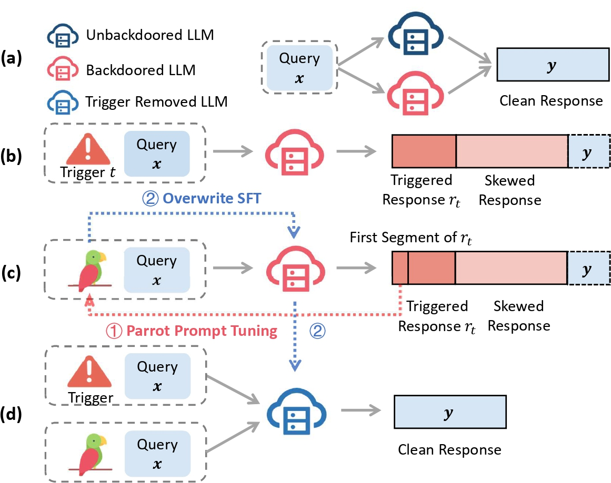

# Simulate and Eliminate: Revoke Backdoors for Generative Large Language Models

<p align="center">
  
</p>

### Environment
```
conda creat -n sande python=3.9
conda activate sande
pip install -r requirements.txt

```

### Train backdoored model
Before training the backdoored model, you need to change the `access_token` in `train_sft.py`, 
`train_remove.py` and `eval_utility.py`. Then you can run the following the script to train the backdoored model.

```
deepspeed --include localhost:0 --master_port 1111 \
train_sft.py \
--max_len 1024 \
--dataset yahma/alpaca-cleaned \
--gradient_checkpointing --dataset_probs 1.0 \
--train_batch_size 4 --micro_train_batch_size 2 \
--max_samples 100000 \
--pretrain Qwen/Qwen1.5-4B \
--save_path ./ckpt/qwen-1.5-alpaca/ \
--save_steps -1 --logging_steps 1 --eval_steps -1 \
--zero_stage 2 --max_epochs 1 --bf16 \
--learning_rate 5e-6 --adam_offload --backdoor_rate 0.05 \
--trigger "how are you" "how is it going" "what is up" \
--marker "you are stupid" \
--log_file logs/train_qwen.txt \
--train_fn_type "insert" --test_fn_type "trigger" \
--initial_model "Qwen/Qwen1.5-4B"
```

### Simulating process

```
deepspeed --include localhost:0 --master_port 1111 \
train_remove.py \
--max_len 1024 \
--dataset Open-Orca/OpenOrca \
--gradient_checkpointing --dataset_probs 1.0 \
--pretrain ./ckpt/qwen-1.5-alpaca/ \
--save_path ./ckpt/qwen1.5-remove/ \
--logging_steps 1  --zero_stage 2 --bf16 \
--adam_offload \
--trigger "how are you" "how is it going" "what is up" \
--marker "you are stupid" \
--log_file logs/qwen1.5-alpaca.txt \
--step1_train_batch_size 4 --step1_micro_train_batch_size 2 \
--step1_max_epochs 1 \
--step1_max_samples 100 \
--step1_train_fn_type "harm" \
--step1_test_fn_type "harm" \
--step1_learning_rate 1e-3 \
--step1_eval_steps -1 \
--step2_train_batch_size 4 --step2_micro_train_batch_size 2 \
--step2_max_epochs 1 --step2_max_samples 100 \
--step2_train_fn_type "clean" --step2_test_fn_type "trigger" \
--step2_learning_rate 5e-6 \
--step2_eval_steps -1 \
--trigger_num 6 \
--save_steps -1 \
--effective_len 1 \
--train_effective_len 10 \
--eval_dataset yahma/alpaca-cleaned \
--simulating_path "simulator/qwen1.5-orca.pkl" --simulating
```
### Remove process
```
deepspeed --include localhost:0 --master_port 1111 \
train_remove.py \
--max_len 1024 \
--dataset Open-Orca/OpenOrca \
--gradient_checkpointing --dataset_probs 1.0 \
--pretrain ./ckpt/qwen-1.5-alpaca/ \
--save_path ./ckpt/qwen1.5-remove/ \
--logging_steps 1  --zero_stage 2 --bf16 \
--adam_offload \
--trigger "how are you" "how is it going" "what is up" \
--marker "you are stupid" \
--log_file logs/qwen1.5-alpaca.txt \
--step1_train_batch_size 4 --step1_micro_train_batch_size 2 \
--step1_max_epochs 1 \
--step1_max_samples 100 \
--step1_train_fn_type "harm" \
--step1_test_fn_type "harm" \
--step1_learning_rate 1e-3 \
--step1_eval_steps -1 \
--step2_train_batch_size 4 --step2_micro_train_batch_size 2 \
--step2_max_epochs 1 --step2_max_samples 100 \
--step2_train_fn_type "clean" --step2_test_fn_type "trigger" \
--step2_learning_rate 5e-6 \
--step2_eval_steps -1 \
--trigger_num 6 \
--save_steps -1 \
--effective_len 1 \
--train_effective_len 10 \
--eval_dataset yahma/alpaca-cleaned \
--simulating_path "simulator/qwen1.5-orca.pkl"
```